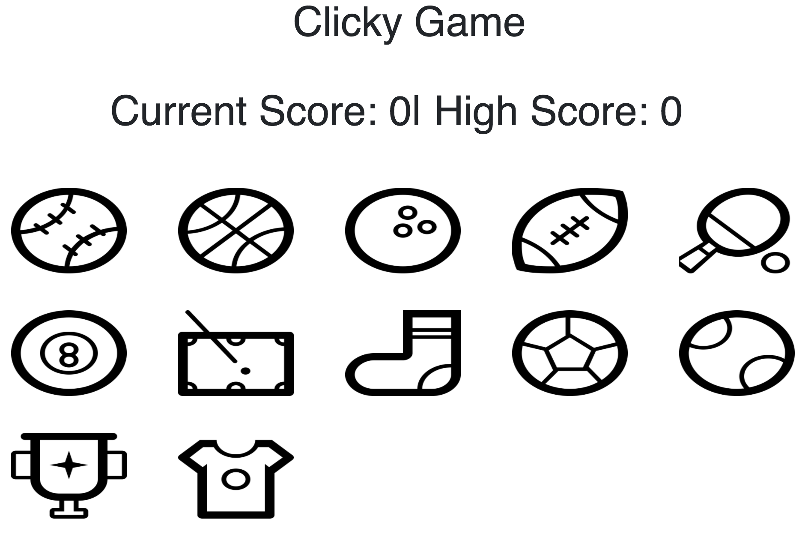
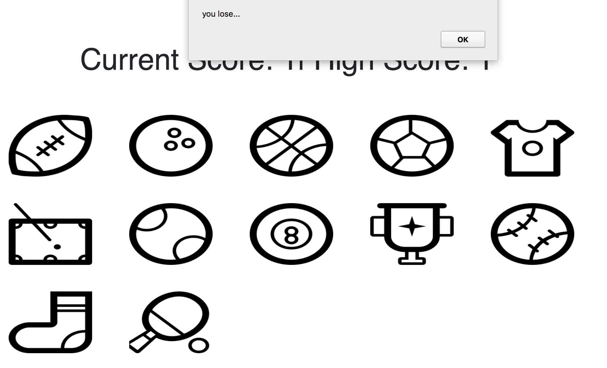
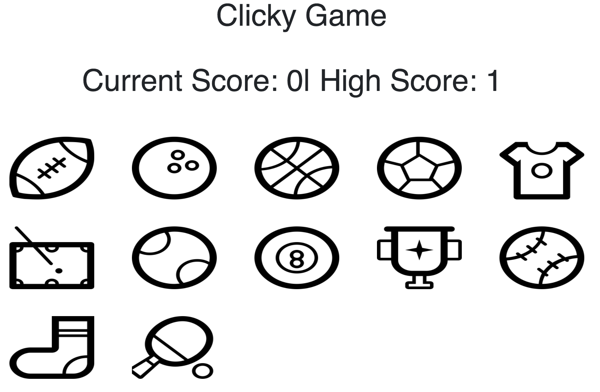

# Clicky Game Sports App
> Test you memory in this ReactJS built Clicky Game 

[![NPM Version][npm-image]][npm-url]

> Check out the functionality live Heroku: https://clicky-game27.herokuapp.com/

> Screenshot of the homepage

> Screenshot of a recorded loss

> Screenshot of a high score

## Dependencies

> react
> react-dom
> react-scripts

## Meta

> Thomas Seaman – thomasseaman27@gmail.com

[https://github.com/ThomasSeaman](https://github.com/ThomasSeaman)

<!-- Markdown link & img dfn's -->
[npm-image]: https://img.shields.io/npm/v/datadog-metrics.svg?style=flat-square
[npm-url]: https://npmjs.org/package/datadog-metrics
[npm-downloads]: https://img.shields.io/npm/dm/datadog-metrics.svg?style=flat-square